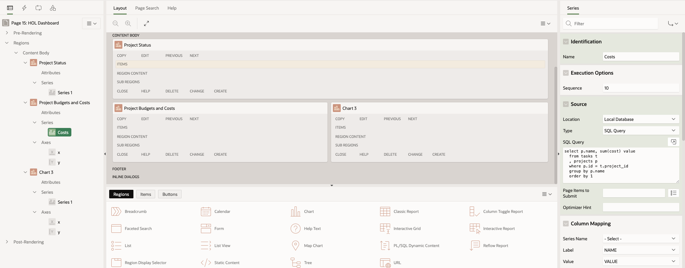
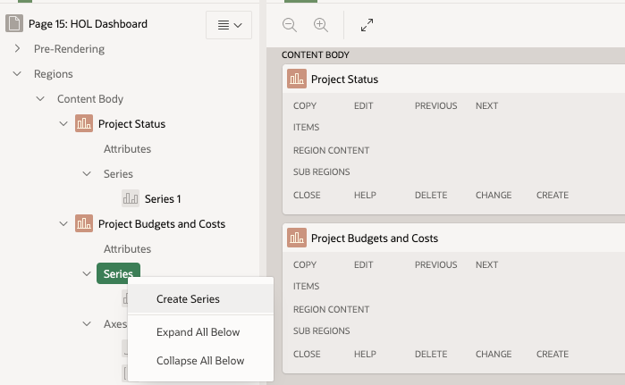

# Create a dashboard page

## Introduction

In this lab, you will develop the Dashboard page generated by the Create App Wizard. You update the series, attributes, and Template Options of the remaining chart region to improve usability and appearance.

Estimated Time: 20 minutes

### Objectives

- Create a dashboard page
- Edit the charts using the Page Designer
- Updating the appearence of the dashboard charts

## **Step 1:** Create a dashboard page

1. Click on Create page and select the Dashboard as a component.

   

2. Enter the name of the Dashboard in the Page Attributes section, select the navigation preference as **Create a new navigation menu entry** and dashboard layout.

   

3. Once the page is created, review the page by clicking the play button. The page is loaded with the default values.

   


## **Step 2:** Edit the charts using the Page Designer

**Chart 1 - Project Status**


1. Select the chart you want to update from the content body section from the page designer. Update the **identification** title.

   

2. Select the **Attributes** under the Project Status section and select the type of chart you want to display. Here we chose a Donut **chart**.

   

3. Now from the **Source**, select the **location** as Local Database, **type** as SQL Query and insert the following SQL query. Also, in the Column Mapping section, select the **label** as Status and **Value** as C.

      ```
      select "STATUS", count(*) c 
      from "PROJECTS" 
      group by "STATUS" 
      order by 2 desc  
      ```

   

4. Click on the play button on the top right to view the chart.

**Chart 2 - Project Status**

1. Select the chart 2. This chart would be more meaningful if it also displayed project budgets for comparison. Update the following in the property editor and save the changes:

**Identification** - Project Budgets and Costs
**Type** - Bar
**Identification** - Name - enter Costs
**Source** - SQL Query - click the Code Editor icon (SQL Query).

      ```
      select p.name, sum(cost) value
      from tasks t
      , projects p
      where p.id = t.project_id
      group by p.name
      order by 1
      ```
**Column Mapping** - Label - Name, Value - Value
         

2. To add a series to a chart, in the Rendering tab, right-click **Series** and select Create Series.


In Property Editor:
**Identification**: Name - Budgets
**Source**: Table Name - click the LOV icon. Select PROJECTS.
**Column Mapping**: Label - select NAME, Value - select BUDGET

Click Save and Run Page. Review the changes to the labels along the X-axis and the new columns for each project. You can also mouse over each column for more details.
 

## **Step 3:** Updating the appearence of the dashboard charts

The chart lacks a legend to indicate which column represents which value (cost or budget). The cost and budget values lack a dollar sign. These changes are in the region attributes and axis properties for the chart.

To change the **attributes** of a region:

1. Go to the Page Designer. In the Rendering tab, under Project Budgets and Costs, click **Attributes**.

2. Updated the properties in the **Property Editor**:
**Layout**: Height - enter 600
**Legend**: Show - click to enable, Position - select Top, Hide and Show Behavior- select No Rescaling

3. To change the properties of an axis, in the Rendering tab, under Axes, click y.

4. Updated the properties in the **Property Editor**:

**Value**: Format - select Currency, Currency - enter $

Click **Save and Run Page.**

 

The runtime reloads, but you must scroll down within the region to see your changes to the chart.

